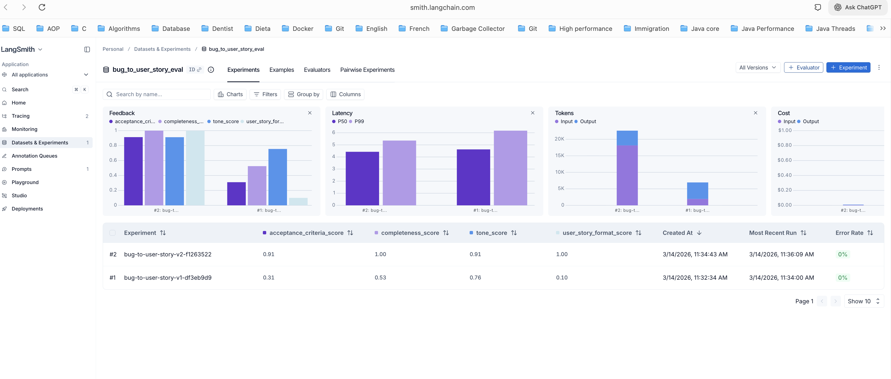
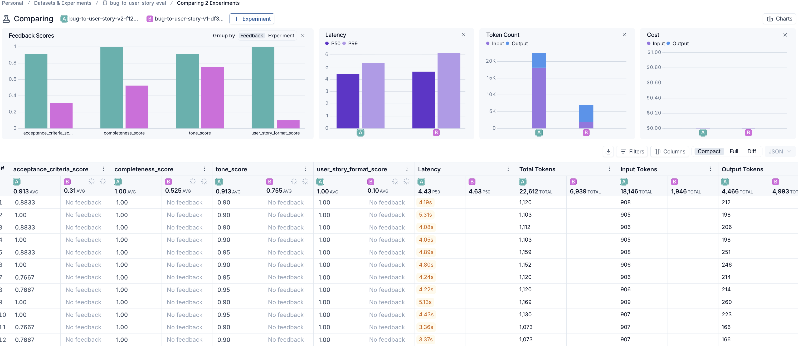

# Prompt Engineering Challenge - LangChain + LangSmith

## Overview
This project pulls low-quality prompts from LangSmith Prompt Hub, optimizes them with advanced prompt engineering techniques, pushes them back to LangSmith, and evaluates quality with custom metrics.

This implementation uses an **Ollama-first strategy**:
- Try local Ollama model first.
- If Ollama is unavailable, automatically fallback to configured cloud provider (OpenAI or Gemini).

## Project Structure

```
desafio-prompt-engineer/
├── .env.example
├── requirements.txt
├── README.md
├── prompts/
│   ├── bug_to_user_story_v2.yml
├── src/
│   ├── pull_prompts.py
│   ├── push_prompts.py
│   ├── evaluate.py
│   ├── metrics.py
│   ├── dataset.py
│   └── utils.py
└── tests/
    └── test_prompts.py
```

## Prerequisites
- Python 3.9+
- LangSmith API key
- One of the following:
  - Ollama running locally with a pulled model (recommended)
  - OpenAI API key
  - Google API key (Gemini)

## Setup

```bash
python3 -m venv venv
source venv/bin/activate
pip install -r requirements.txt
cp .env.example .env
```

Then fill `.env` values.

## Model Resolution Strategy
`src/utils.py` resolves model clients in this strict order:
1. Ollama (`OLLAMA_BASE_URL` + `OLLAMA_MODEL`)
2. OpenAI (`OPENAI_API_KEY`, `OPENAI_MODEL` / `OPENAI_EVAL_MODEL`)
3. Gemini (`GOOGLE_API_KEY`, `GEMINI_MODEL` / `GEMINI_EVAL_MODEL`)

If none is available, execution fails with a clear message telling the user that no model provider is available.

This applies to both generation (`response`) and evaluator (`evaluation`) models.

## Evaluation Modes
Set `EVAL_MODE` in `.env`:
- `heuristic`: deterministic local metrics only
- `llm`: LLM judge metrics only
- `hybrid` (default): average of heuristic + LLM judge scores

If LLM judge output is invalid JSON, evaluation safely falls back to heuristic score for that sample.

## How to Execute

Run the commands below in this exact order.

### 1. Pull baseline prompt (v1) from LangSmith
```bash
python src/pull_prompts.py
```

This creates:
- `prompts/bug_to_user_story_v1.yml`
- `prompts/raw_prompts.yml`

### 2. Evaluate baseline v1 (expected to FAIL)
```bash
EVAL_SAMPLE_SIZE=20 PROMPT_FILE=prompts/bug_to_user_story_v1.yml python src/evaluate.py
```

### 3. Use the enhanced v2 prompt
The optimized prompt file is:
- `prompts/bug_to_user_story_v2.yml`

If needed, edit this file before the next steps.

### 4. Run validation tests for v2
```bash
pytest tests/test_prompts.py
```

### 5. Push optimized prompt (v2) to LangSmith
```bash
python src/push_prompts.py
```

If nothing changed since the last push, LangSmith may return `409 Nothing to commit`.

### 6. Evaluate optimized v2 (expected to PASS)
```bash
EVAL_SAMPLE_SIZE=20 PROMPT_FILE=prompts/bug_to_user_story_v2.yml python src/evaluate.py
```

### 7. Open comparison dashboard
Use the direct compare link after both runs complete:

https://smith.langchain.com/o/7caf0644-4f2f-4c7f-b47e-3f0e95a191fc/datasets/4f0193c5-fa78-44c3-b7f2-bfbacc48dcf3/compare?selectedSessions=3c1c671c-4778-4da9-b6ab-bed0cff746f1%2C3bec634b-c764-459b-90c8-00d8cf8cb2a6&source=3c1c671c-4778-4da9-b6ab-bed0cff746f1

## Applied Techniques (Phase 2)
The optimized prompt (`prompts/bug_to_user_story_v2.yml`) applies these advanced techniques:

1. Role Prompting
- Why: sets a stable persona and domain context for consistent output quality.
- How applied: system prompt starts with "You are a Senior Product Manager..." and enforces behavior rules.

2. Few-shot Learning
- Why: gives the model concrete examples of the exact output quality and format expected.
- How applied: two complete input/output examples are included (password reset tokens and mobile Safari checkout).

3. Skeleton of Thought
- Why: improves reasoning quality without exposing chain-of-thought details in the final output.
- How applied: explicit step structure in system prompt:
  - identify persona
  - define behavior/value
  - produce concise user story
  - produce measurable acceptance criteria

## Final Results
Latest evaluation was executed with 20 samples (`EVAL_SAMPLE_SIZE=20`) for both v1 and v2.

### Evaluation Summary (Heuristic Mode - 20 samples)

| Metric                     | v1 (Baseline) | v2 (Optimized) | Improvement |
|----------------------------|----------------|----------------|-------------|
| Tone Score                 | 0.7550         | 0.9125         | +20.9%      |
| Acceptance Criteria Score  | 0.3100         | 0.9133         | +194.6%     |
| User Story Format Score    | 0.1000         | 1.0000         | +900.0%     |
| Completeness Score         | 0.5250         | 1.0000         | +90.5%      |
| **Average Score**          | **0.4225**     | **0.9565**     | **+126.4%** |

### Status
- v1: FAILED
- v2: APPROVED

## LangSmith Dashboard
- **Source prompt (v1)**: `leonanluppi/bug_to_user_story_v1`
- **Published prompt (v2)**: `initialhandle/bug_to_user_story_v2`
- **Public prompt URL**: https://smith.langchain.com/hub/initialhandle/bug_to_user_story_v2
- **Latest commit**: https://smith.langchain.com/hub/initialhandle/bug_to_user_story_v2/ff270305
- **Public evaluation dashboard (20 samples)**: https://smith.langchain.com/o/7caf0644-4f2f-4c7f-b47e-3f0e95a191fc/datasets/4f0193c5-fa78-44c3-b7f2-bfbacc48dcf3
- **Direct v1 vs v2 compare (20 samples)**: https://smith.langchain.com/o/7caf0644-4f2f-4c7f-b47e-3f0e95a191fc/datasets/4f0193c5-fa78-44c3-b7f2-bfbacc48dcf3/compare?selectedSessions=3c1c671c-4778-4da9-b6ab-bed0cff746f1%2C3bec634b-c764-459b-90c8-00d8cf8cb2a6&source=3c1c671c-4778-4da9-b6ab-bed0cff746f1
- **Evaluation Dataset**: `bug_to_user_story_eval` (created automatically during evaluation)

## Evaluation Screenshots



- v1 low-score evaluation (expected to FAIL)
- v2 approved evaluation (all metrics >= 0.9)
- Traces for at least 3 examples

## Comparative Results: v1 vs v2 (20 samples)

### How Results Were Generated

```bash
# Run v1 evaluation with 20 samples
EVAL_SAMPLE_SIZE=20 PROMPT_FILE=prompts/bug_to_user_story_v1.yml python src/evaluate.py

# Run v2 evaluation with 20 samples
EVAL_SAMPLE_SIZE=20 PROMPT_FILE=prompts/bug_to_user_story_v2.yml python src/evaluate.py
```

### Key Improvements from v1 to v2

1. **Tone Score (+20.9%)**: clearer and more consistent wording with v2 constraints.
2. **Acceptance Criteria Score (+194.6%)**: strong Given/When/Then coverage in v2.
3. **User Story Format Score (+900.0%)**: strict structure enforcement in v2.
4. **Completeness Score (+90.5%)**: v2 consistently includes complete sections and edge cases.

### Techniques Applied in v2

- **Role Prompting**: Senior Product Manager persona for consistent quality
- **Few-shot Learning**: Two complete examples (password reset, mobile Safari checkout)
- **Skeleton of Thought**: Step-by-step reasoning structure
- **Output Validation**: Strict format enforcement
- **Constraint Satisfaction**: All requirements must be met
- **One-liner Comments**: Each technique identified in prompt file

## Spec Compliance Notes
- Required folders/files are present according to the challenge structure.
- `pull_prompts.py` saves pulled prompt to both:
  - `prompts/bug_to_user_story_v1.yml`
  - `prompts/raw_prompts.yml`
- Both command names are supported:
  - `python src/pull_prompts.py` and `python src/pull_prompts.py`
  - `python src/push_prompts.py` and `python src/push_prompts.py`
- Required pytest validations are implemented in `tests/test_prompts.py`.

## Notes
- Keep evaluation dataset unchanged.
- Perform 3-5 optimization iterations until all required metrics are >= 0.9.
- Publish final v2 prompt publicly on LangSmith Prompt Hub.
